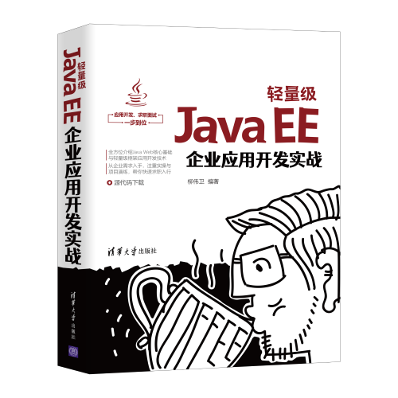

# Java EE Enterprise Development. 《Java EE企业级开发实战》示例源码

包含示例如下：

* [Hello World](samples/hello-world)
* [使用Eclipse创建Maven应用](samples/hello-eclipse)
* [使用IntelliJ IEDA创建Maven应用](samples/hello-idea)
* [创建基于Servlet的Web应用](samples/hello-servlet)
* [在应用里面内嵌Tomcat容器](samples/hello-tomcat)
* [在应用里面内嵌Jetty容器（Maven插件方式）](samples/hello-jetty)
* [在应用里面内嵌Jetty容器（Server方式）](samples/jetty-server)
* [使用JDBC操作数据库](samples/hello-jdbc)
* [使用数据库连接池DBCP](samples/hello-dbcp)
* [依赖注入的例子](samples/dependency-injection)
* [使用@AspectJ的例子](samples/aop-aspect)
* [基于XML的AOP的例子](samples/aop-aspect-xml)
* [使用SpEL的例子](samples/expression-language)
* [服务端测试Spring Web MVC的例子](samples/mvc-test)
* [声明式事务管理的例子](samples/declarative-transaction)
* [基于Spring Web MVC的JSON类型的处理](samples/mvc-json)
* [基于Spring Web MVC的XML类型的处理](samples/mvc-xml)
* [基于Spring Security安全认证](samples/security-basic)
* [使用MyBatis操作数据库](samples/hello-mybatis)
* [基于Thymeleaf的Web应用](samples/mvc-thymeleaf)
* [基于Bootstrap的Web应用](samples/mvc-thymeleaf-bootstrap)
* [基于RestTemplate的天气预报服务](samples/rest-template)
* [基于WebClient的文件上传、下载](samples/webclient-file)
* [基于Jersey的REST服务](samples/jersey-rest)
* [基于SSE构建实时Web应用](samples/sse-real-time-web)
* [基于STOMP的聊天室](samples/websocket-stomp)
* [基于JMS的消息发送、接收](samples/jms-msg)
* [实现Email服务器](samples/java-mail)
* [基于Quartz Scheduler天气预报系统](samples/quartz-scheduler)
* [基于缓存的天气预报系统](samples/java-cache)
* [开启第一个Spring Boot项目](samples/initializr-start)
* [实现微服务的注册与发现——Eureka Server](samples/eureka-client)
* [实现微服务的注册与发现——Eureka Client](samples/eureka-server)
* 陆续整理中...

## 配套书籍《轻量级Java EE企业应用开发实战》

与该源码配套的书籍《轻量级Java EE企业应用开发实战》已经出版，内容详见全书[目录](SUMMARY.md)。

视频介绍见：<https://www.bilibili.com/video/BV1YK4y1U7S7>

本书如有勘误，会在<https://github.com/waylau/java-ee-enterprise-development-samples/issues>上进行发布。由于笔者能力有限，时间仓促，难免错漏，欢迎读者批评指正。

您也可以上[豆瓣](https://book.douban.com/subject/35085913/)给老卫打Call。

## 如何获取本书

实体店及各大网店有售。据我所知有如下网站供应：

* [京东](https://search.jd.com/Search?keyword=%E5%88%86%E5%B8%83%E5%BC%8F%E7%B3%BB%E7%BB%9F%E5%BC%80%E5%8F%91%E5%AE%9E%E6%88%98%20%E6%9F%B3%E4%BC%9F%E5%8D%AB&enc=utf-8&wq=%E5%88%86%E5%B8%83%E5%BC%8F%E7%B3%BB%E7%BB%9F%E5%BC%80%E5%8F%91%E5%AE%9E%E6%88%98%20%E6%9F%B3%E4%BC%9F%E5%8D%AB&pvid=0faabd7ef54c4d3daabd5dcdd8012850)
* [当当](http://search.dangdang.com/?key=%B7%D6%B2%BC%CA%BD%CF%B5%CD%B3%BF%AA%B7%A2%CA%B5%D5%BD%20%C1%F8%CE%B0%CE%C0&act=input)

想低于市价得到本书？来[二手书集市](https://github.com/waylau/second-hand-books)试试看。

也可以直接关注我博客（<https://waylau.com/>）或者我的开源书（<https://waylau.com/books/>）了解更多免费咨询。

## 联系作者

您也可以直接联系我：

* 博客：https://waylau.com
* 邮箱：[waylau521(at)gmail.com](mailto:waylau521@gmail.com)
* 微博：http://weibo.com/waylau521
* 开源：https://github.com/waylau

## 其他书籍

若您对本书不感冒，笔者还写了其他方面的超过一打的书籍（可见<https://waylau.com/books/>），多是开源电子书。

本人也维护了一个[books-collection](https://github.com/waylau/books-collection)项目，里面提供了优质的专门给程序员的开源、免费图书集合。

## 开源捐赠

捐赠所得所有款项将用于开源事业！见[捐赠列表](https://waylau.com/donate)。
